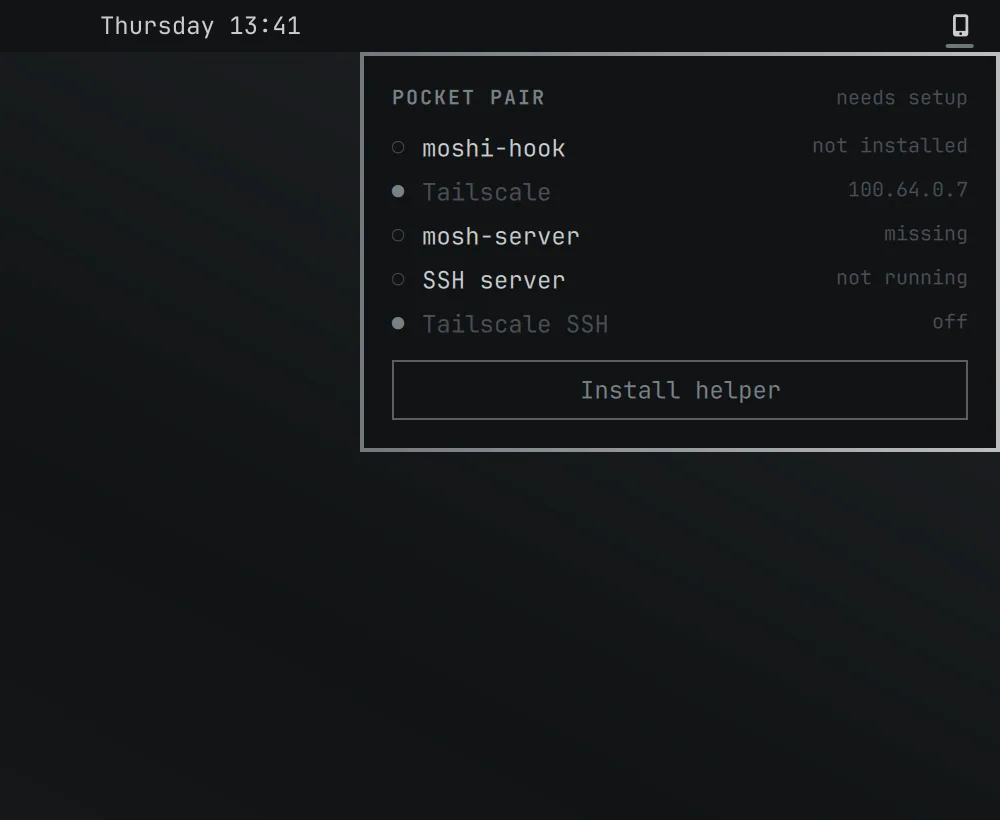

# Pocket Pair

Pair your phone's [Moshi](https://getmoshi.app) terminal app with this Omarchy machine in a few clicks.

Moshi's own installer and `moshi-hook host setup` stop on Omarchy: its install hints cover only macOS, Debian/Ubuntu and Fedora, and two things it never checks (an SSH server that is switched off, and Tailscale answering port 22 for itself) break the connection even after pairing. Pocket Pair is a bar widget and one panel that checks all of that for you, fixes what is missing, and shows the pairing QR.


*The QR in this picture is a placeholder, not a real pairing code.*

> Pocket Pair is an independent community plugin. It is not made by, affiliated with, or endorsed by Moshi. The name "Moshi" is used only to say what the plugin works with.
>
> This plugin was written with the help of an AI coding agent (Claude) and reviewed by its maintainer.

## Screenshots

Every picture and clip below was captured from a throwaway Omarchy shell on a headless output, with a stand-in `moshi-hook`, no network, and made-up values (the phone names, `100.64.0.7` and `omarchy-demo` are fake). The QR in every frame encodes the placeholder text `pocketpair-demo://fake-link-not-a-real-pairing-code`, not a pairing link. No Moshi logo or colours are used; the panel takes its colours from the Omarchy theme.


[Same clip as MP4](media/pair-flow.mp4) (about 11 seconds).

| Step | |
| --- | --- |
| The bar glyph, unpaired (top) and paired (bottom, theme accent) |  |
| 1. Checks run and the first missing piece is offered: install the helper |  |
| 2. One terminal for whatever needs root; it lists the exact commands first |  |
| 3. Everything in place: one click to the QR |  |
| 4. The QR with its five-minute countdown |  |
| 5. After pairing: status and the paired phones, each with a revoke button |  |

### Follows your Omarchy theme


[Same clip as MP4](media/pair-themes.mp4). Stills in two other themes: [Tokyo Night](media/theme-tokyo-night.webp) and [Catppuccin Latte](media/theme-catppuccin-latte.webp).

## How it works

Click the phone glyph in the bar. The panel runs every check on its own and shows one button for the next step:

1. **Install helper**: downloads `moshi-hook` (no root needed).
2. **Set up in a terminal**: only if something needs root. One terminal opens, prints the commands, then asks for your password.
3. **Show QR**: scan it with the Moshi app. It expires after 5 minutes.

When everything is already in place it is one click to the QR. After pairing, the panel shows only the paired status and your paired phones, each with a revoke button. The bar glyph turns the theme accent while a phone is paired. Colours follow your Omarchy theme.

## Two ways to connect

| | Tailscale (recommended) | Home network |
| --- | --- | --- |
| Works from | anywhere | the same Wi-Fi only |
| Firewall | no change | opens SSH and Mosh to your own subnet |
| Pairs against | this machine's Tailscale address | this machine's home-network address |

**Tailscale is the recommended first choice**: it works away from home, needs no firewall change (Tailscale normally accepts traffic arriving on its own `tailscale0` interface ahead of ufw's rules), and nothing is exposed to your local network. When Tailscale is missing or signed out, the panel's main button is **Set up Tailscale**. It opens one terminal that prints, then runs:

```sh
sudo pacman -S tailscale              # skipped if it is already installed
sudo systemctl enable --now tailscaled
sudo tailscale up
```

Below it, a small **Use my home network instead** link switches to the home-network mode. The choice is saved in the widget's own setting (`network`), and **Use Tailscale instead (recommended)** switches back.

### Home network mode

For people without Tailscale. The panel runs the same checks (`mosh`, the SSH server) except Tailscale SSH, detects this machine's address and subnet from the default route's interface (`ip -j route`, `ip -j -4 addr`), checks that SSH accepts keys only (next section), and, if ufw is active, adds one step: **Open firewall for your home network**. It opens one terminal that prints the commands first, with your detected subnet (192.168.1.0/24 here is only an example):

```sh
sudo ufw allow from 192.168.1.0/24 to any port 22 proto tcp
sudo ufw allow from 192.168.1.0/24 to any port 60000:61000 proto udp
mkdir -p ~/.local/state/pocket-pair && { grep -qxF 192.168.1.0/24 ~/.local/state/pocket-pair/lan-subnets 2>/dev/null || echo 192.168.1.0/24 >> ~/.local/state/pocket-pair/lan-subnets; }
```

The last line adds the subnet to a list (one per line, no root) in `~/.local/state/pocket-pair/lan-subnets`, so the panel can tell the rules are in place; reading `ufw status` itself needs root. Every subnet you open is appended, so joining another Wi-Fi and opening it too never loses track of the first. Then it pairs with `moshi-hook host setup --json --host <your home-network address>`.

- **Same Wi-Fi only.** The phone must be on this network. There is no port forwarding and no UPnP: Pocket Pair never sets either up and advises against it.
- **Scoped, never "anywhere".** Every rule says `from <your subnet>`. Pocket Pair writes no rule without it, and never edits `sshd_config` itself (its one SSH change is the drop-in file described below).
- **Keys only, never passwords.** Once the check below passes, SSH on the network accepts keys only: the phone's key plus any keys already in `~/.ssh/authorized_keys`. Until it passes, the firewall step and the QR stay locked.
- **Refused when it is not a home network.** If the address is not private (RFC 1918: 10.0.0.0/8, 172.16.0.0/12, 192.168.0.0/16), or no subnet can be worked out, the panel says so and does not offer the firewall step. IPv4 only.
- If ufw is not installed or not active, no firewall step is shown.

#### SSH must be keys only first

Opening SSH to your network while passwords still work would let anyone on it try to guess one, so the home-network mode will not open the firewall, and will not show the QR, until SSH is verified to accept keys only. Omarchy's own hardening (`/etc/ssh/sshd_config.d/10-omarchy-hardening.conf`) is not always there: the SSH server may have been switched on before it existed, and Omarchy's migration deliberately leaves passwords on when it finds no usable key. So "sshd is running" is not enough.

- **What is checked.** Password and keyboard-interactive login must both be off, key login must not be off, and `AuthenticationMethods` must not require a password method. The panel reads the readable SSH config (`/etc/ssh/sshd_config` with its `Include` lines expanded, by [`scripts/read-sshd-config.sh`](scripts/read-sshd-config.sh)) with sshd's own rule that the first value wins. **Anything it cannot prove is treated as not key-only**: an unreadable file, an `Include` that points into a directory it cannot list, a too deeply nested or quoted include, an unusual value.
- **When it cannot prove it, Pocket Pair stops.** If the panel cannot read or verify all of the configuration (an unreadable `Include`, even one outside `sshd_config.d`, could hold a `Match` block that allows passwords on your network), it offers no fix: it does not write the drop-in, and it does not start or reload SSH, whether or not ufw is active. The panel says which file or `Match` block to look at. The same goes for a `Match` block that touches sign-in (`PasswordAuthentication`, `KbdInteractiveAuthentication`, `AuthenticationMethods`, `PubkeyAuthentication`), which `sshd -T` does not evaluate. Review it yourself so it allows keys only and can be read without root, or use Tailscale; Pocket Pair never edits it. The checklist row reads **not verified: review by hand** or **Match block: review by hand**.
- **Asked of sshd itself, as root.** The terminal steps run `sudo sshd -T`, which prints the effective configuration, and require the same four lines. `sshd -T` reports the global values only, and a `Match` block overrides them for the connections it matches, so the same check also reads every file sshd reads, as root: `sshd_config` and each `Include`, recursively and in place (an `Include` inside a `Match` block stays inside it). It fails, naming the file or line to review, on a `Match` block with a sign-in keyword in it, a quoted `Include`, includes nested past sshd's limit of 16, or a file it cannot read. The root check is the last word, whatever the panel showed: the firewall step runs it as its first command, so the rules are never added if it fails, and a stopped sshd is not started (`sudo systemctl enable --now sshd`) until it has passed, even if the panel was out of date.
- **If SSH is not key-only**, the panel offers **Make SSH keys-only**. One terminal prints these commands, then asks for your password (`sudo`). It runs them in order and stops at the first failure:

```sh
printf "%s\n" "# Written by Pocket Pair: SSH accepts keys only. Delete this file and run sudo systemctl reload sshd to allow passwords again." "PasswordAuthentication no" "KbdInteractiveAuthentication no" | sudo install -Dm644 /dev/stdin /etc/ssh/sshd_config.d/10-pocket-pair-keyonly.conf
sudo sshd -t || { sudo rm -f /etc/ssh/sshd_config.d/10-pocket-pair-keyonly.conf; echo "..."; false; }
[ "$(sudo sshd -T | grep -ixcE "(passwordauthentication|kbdinteractiveauthentication) no|pubkeyauthentication yes|authenticationmethods (any|publickey)")" = 4 ] && sudo bash -c '...reads sshd_config and every Include as root, fails on a sign-in rule inside a Match block or a file it cannot read...' pocket-pair /etc/ssh || { sudo rm -f /etc/ssh/sshd_config.d/10-pocket-pair-keyonly.conf; echo "..."; false; }
{ ! systemctl is-active --quiet sshd || sudo systemctl reload sshd; }
```

  The file is written first, sshd validates it (`sshd -t`), `sshd -T` confirms the result, and only then is a running sshd reloaded (new connections only; sessions already open stay connected). If sshd rejects its configuration, an earlier rule such as one in a lower-numbered drop-in still allows passwords, or the root check cannot verify an included file or finds a `Match` block that touches sign-in, Pocket Pair removes its own file again, says so, and goes no further: sshd is not started or reloaded. `sshd_config` itself and sudoers are never edited, and no `ufw limit` or any rule without `from <subnet>` is used. When sshd is off, the file is written, and the root check passed, before `sudo systemctl enable --now sshd` starts it, so the server never listens with passwords on because of this plugin. If SSH already reads as keys only but sshd is off, the same root check still runs first.
- **To undo it:** `sudo rm /etc/ssh/sshd_config.d/10-pocket-pair-keyonly.conf && sudo systemctl reload sshd`. Passwords work again unless another rule turns them off. Omarchy's own file is a separate one and is never touched. Closing the firewall again does not undo this file.
- **Who can sign in.** With keys only on, SSH accepts the key your phone pairs with **and every key already in `~/.ssh/authorized_keys`**. Pocket Pair adds only the phone's key and revokes only that key; it never adds, edits or removes the others. The panel shows how many keys are already there (a count, never the keys). That file is the usual place sshd looks; keys supplied some other way (`AuthorizedKeysFile` elsewhere, `AuthorizedKeysCommand`) are not counted.
- **No keys found.** That is safe: with keys only on and an empty or missing `authorized_keys` (and no keys supplied another way), nobody can sign in over SSH until pairing adds the phone's key. The steps are ordered so there is never a moment where SSH is reachable from your network with passwords on because of Pocket Pair. The one consequence worth knowing: if you or someone else signs in to this machine over SSH with a password today, that stops working. The panel and the terminal both say so (and how many keys already exist) before the password prompt, and a refusal at the prompt changes nothing.

**To close the firewall again**, press **close the firewall again** in the panel. It shows whenever any subnet is recorded, in either mode and on any network, and closes exactly the recorded subnets. Switching from home network to Tailscale while rules are open asks whether to close them first. A terminal prints and runs, for each recorded subnet:

```sh
sudo ufw delete allow from 192.168.1.0/24 to any port 22 proto tcp
sudo ufw delete allow from 192.168.1.0/24 to any port 60000:61000 proto udp
sed -i "\|^192\.168\.1\.0/24\$|d" ~/.local/state/pocket-pair/lan-subnets
```

A subnet is removed from the list only after both of its deletes succeeded, and the deletes are safe to repeat. You can also run those lines yourself with your own subnet. Removing the plugin does not close them.

## Requirements

- Omarchy with the shell plugin system (Omarchy 4)
- Either Tailscale, signed in, on this machine and your phone (recommended), or a phone on the same home network
- `qrencode` (ships with Omarchy)

## Install

```sh
omarchy plugin add https://github.com/RibatTRW/pocket-pair.git --enable
```

## Remove

```sh
omarchy plugin remove ribattrw.pocket-pair
```

That removes the plugin only. It does not uninstall `moshi-hook`, `mosh`, or undo the fixes below. To also remove the helper: `moshi-hook service uninstall && rm ~/.local/bin/moshi-hook ~/.local/bin/moshi`.

## What each step does, and why

### Install helper (no root)

Runs [`scripts/install-moshi-hook.sh`](scripts/install-moshi-hook.sh). It does what Moshi's installer does, without piping a download into a shell:

- installs a pinned release (currently `v0.4.20`) rather than whatever is latest
- downloads `moshi-hook_Linux_<arch>.tar.gz` and `checksums.txt` for that version from `cdn.getmoshi.app`
- **refuses to install unless the SHA-256 matches** both the hash embedded in the script and `checksums.txt` (Moshi's own script skips the check if the file is missing; this one does not)
- installs to `~/.local/bin/moshi-hook` (plus a `moshi` alias) and runs `moshi-hook service install` to start the background service

To bump the pin, edit `VERSION` and the two `SHA256_*` values at the top of the script, copying the hashes from `https://cdn.getmoshi.app/hook/<version>/checksums.txt`.

It skips Moshi's interactive first-run settings; run `moshi-hook set --first-run` later if you want them. Later updates use `moshi-hook update` (the panel offers it when a newer version exists).

### The commands that need root

The panel never runs `sudo` itself. When one of these is needed it opens Omarchy's floating terminal, prints the exact commands, and the password prompt is sudo's own. The Tailscale and home-network firewall commands are listed above; these are the common ones.

| Command | Why |
| --- | --- |
| `sudo pacman -S mosh` | `moshi-hook host setup` requires `mosh-server`. |
| `sudo systemctl enable --now sshd` | Omarchy ships OpenSSH but leaves it off, so the phone would have nothing to connect to. The Arch unit is `sshd` (Debian calls it `ssh`). In home-network mode it only runs after SSH has been verified keys only as root (see [SSH must be keys only first](#ssh-must-be-keys-only-first)). |
| Home network mode only: the key-only drop-in and `sshd -t` / `sshd -T` / reload commands under [SSH must be keys only first](#ssh-must-be-keys-only-first) | SSH on your network must accept keys only before the firewall is opened or the QR is shown. |
| `sudo tailscale set --ssh=false` | Tailscale mode only. While Tailscale SSH is on, Tailscale answers port 22 on your tailnet itself, so the key Moshi adds to `~/.ssh/authorized_keys` would never be used. |

Pocket Pair never edits `sshd_config` or sudoers. In home-network mode only, it adds the one `sshd_config.d` drop-in described under [SSH must be keys only first](#ssh-must-be-keys-only-first), and nothing else about the SSH server's configuration. In Tailscale mode it does not change the firewall: Omarchy's firewall (ufw) denies incoming connections by default and that is left alone, and this plugin does not verify that Tailscale traffic gets through ahead of it. In home-network mode the only firewall change is the two scoped rules above, and only after SSH is verified keys only. If your phone still cannot connect after pairing, check your firewall rules for port 22.

### Pairing and the QR

The panel runs `moshi-hook host setup --json --host <your Tailscale or home-network address>` and draws the link it prints with `qrencode`. When the phone finishes, it runs `moshi-hook service restart`. Closing the panel or pressing Cancel stops the pairing session.

**The QR is an access token**: anyone who scans it before it expires can claim SSH access to this machine. Pocket Pair never logs, saves, or copies the link, and passes it to `qrencode` through the environment rather than a command line. Do not share your screen while it is showing.

### Revoke

Removes the phone's key from `~/.ssh/authorized_keys` with `moshi-hook host revoke`.

## Settings

| Key | Meaning |
| --- | --- |
| `hookBinary` | Path to `moshi-hook`. Leave blank to find it automatically. |
| `network` | `tailscale` (default, recommended) or `lan` for the home network. The panel switches it for you. |

## Development

```sh
omarchy plugin validate .
node --test test/*.test.mjs
```

Pure logic (parsing, mode selection, subnet detection and refusal, the exact command strings, the next-step rules, the QR matrix) lives in `Model.js` and is covered by `test/model.test.mjs`. `Engine.qml` owns the processes, `Panel.qml` the UI.

The running shell keeps serving the plugin code it first loaded, so to try an edit live, install a copy under a fresh plugin id (change `id` in `manifest.json` and `moduleName` in the QML) and remove it afterwards.

## License

MIT. See [LICENSE](LICENSE).
