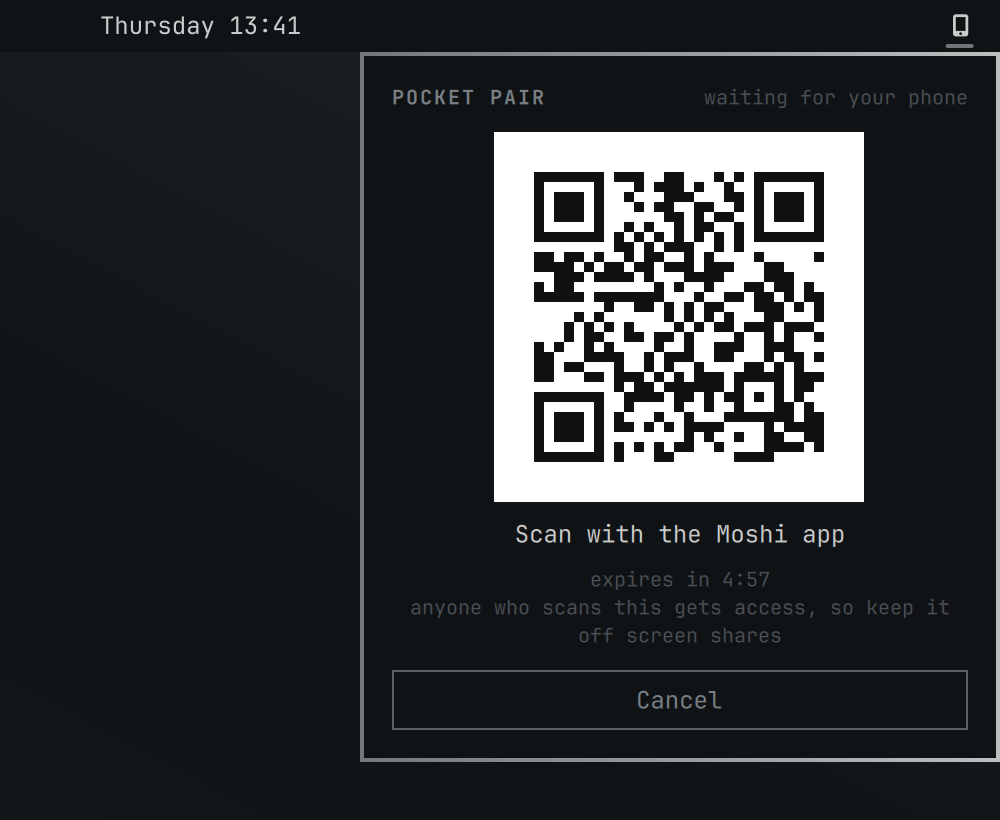
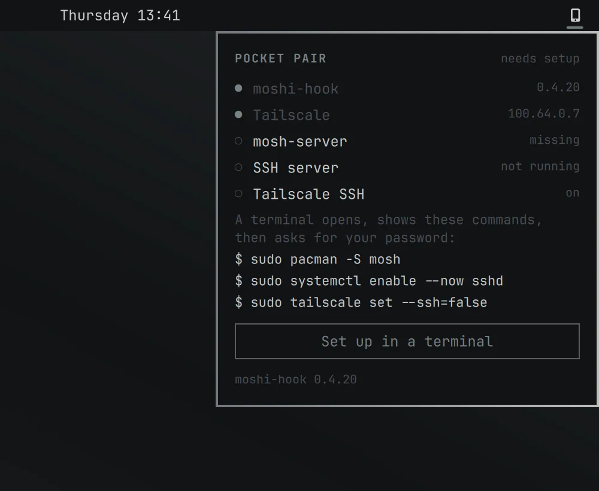
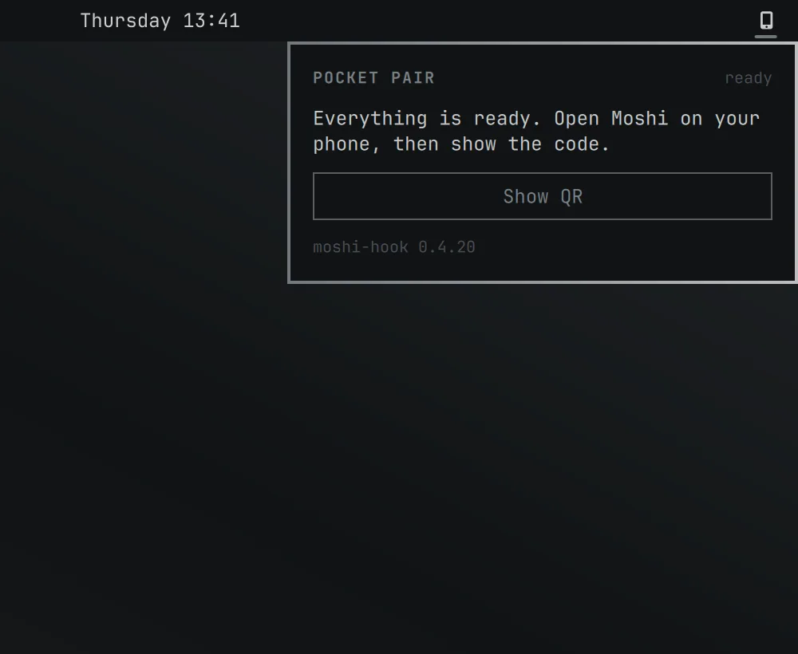
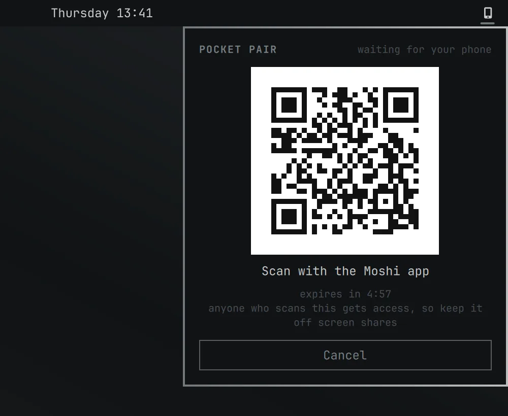
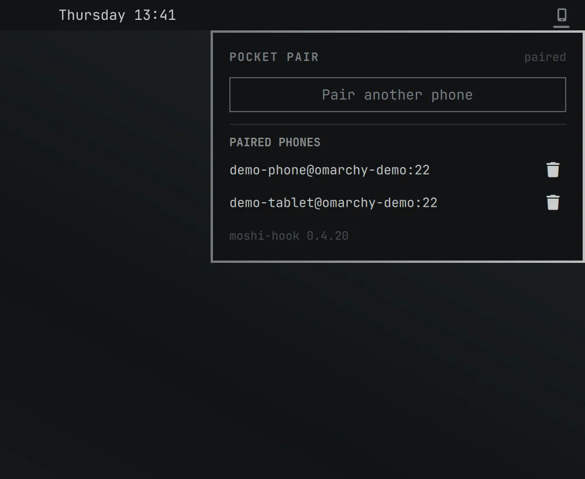
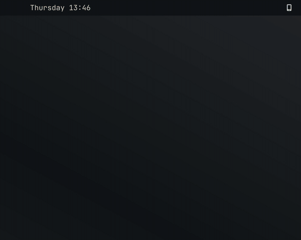

# Pocket Pair

Pair your phone's [Moshi](https://getmoshi.app) terminal app with this Omarchy machine in a few clicks.

Moshi's own installer and `moshi-hook host setup` stop on Omarchy: its install hints cover only macOS, Debian/Ubuntu and Fedora, and two things it never checks (an SSH server that is switched off, and Tailscale answering port 22 for itself) break the connection even after pairing. Pocket Pair is a bar widget and one panel that checks all of that for you, fixes what is missing, and shows the pairing QR.



*The QR in this picture is a placeholder, not a real pairing code.*

> Pocket Pair is an independent community plugin. It is not made by, affiliated with, or endorsed by Moshi. The name "Moshi" is used only to say what the plugin works with.
>
> This plugin was written with the help of an AI coding agent (Claude) and reviewed by its maintainer.

## Screenshots

Every picture and clip below was captured from a throwaway Omarchy shell on a headless output, with a stand-in `moshi-hook`, no network, and made-up values (the phone names, `100.64.0.7` and `omarchy-demo` are fake). The QR in every frame encodes the placeholder text `pocketpair-demo://fake-link-not-a-real-pairing-code`, not a pairing link. No Moshi logo or colours are used; the panel takes its colours from the Omarchy theme.


[Same clip as MP4](media/pair-flow.mp4) (about 11 seconds).

| Step | |
| --- | --- |
| The bar glyph, unpaired (top) and paired (bottom, theme accent) |  |
| 1. Checks run and the first missing piece is offered: install the helper |  |
| 2. One terminal for whatever needs root; it lists the exact commands first |  |
| 3. Everything in place: one click to the QR |  |
| 4. The QR with its five-minute countdown |  |
| 5. After pairing: status and the paired phones, each with a revoke button |  |

### Follows your Omarchy theme



[Same clip as MP4](media/pair-themes.mp4). Stills in two other themes: [Tokyo Night](media/theme-tokyo-night.webp) and [Catppuccin Latte](media/theme-catppuccin-latte.webp).

## How it works

Click the phone glyph in the bar. The panel runs every check on its own and shows one button for the next step:

1. **Install helper**: downloads `moshi-hook` (no root needed).
2. **Set up in a terminal**: only if something needs root. One terminal opens, prints the commands, then asks for your password.
3. **Show QR**: scan it with the Moshi app. It expires after 5 minutes.

When everything is already in place it is one click to the QR. After pairing, the panel shows only the paired status and your paired phones, each with a revoke button. The bar glyph turns the theme accent while a phone is paired. Colours follow your Omarchy theme.

Pairing is over your tailnet only: the phone connects to this machine's Tailscale address. Nothing is opened on your LAN or router.

## Requirements

- Omarchy with the shell plugin system (Omarchy 4)
- Tailscale, signed in, on this machine and your phone
- `qrencode` (ships with Omarchy)

## Install

```sh
omarchy plugin add https://github.com/RibatTRW/pocket-pair.git --enable
```

## Remove

```sh
omarchy plugin remove ribattrw.pocket-pair
```

That removes the plugin only. It does not uninstall `moshi-hook`, `mosh`, or undo the fixes below. To also remove the helper: `moshi-hook service uninstall && rm ~/.local/bin/moshi-hook ~/.local/bin/moshi`.

## What each step does, and why

### Install helper (no root)

Runs [`scripts/install-moshi-hook.sh`](scripts/install-moshi-hook.sh). It does what Moshi's installer does, without piping a download into a shell:

- installs a pinned release (currently `v0.4.20`) rather than whatever is latest
- downloads `moshi-hook_Linux_<arch>.tar.gz` and `checksums.txt` for that version from `cdn.getmoshi.app`
- **refuses to install unless the SHA-256 matches** both the hash embedded in the script and `checksums.txt` (Moshi's own script skips the check if the file is missing; this one does not)
- installs to `~/.local/bin/moshi-hook` (plus a `moshi` alias) and runs `moshi-hook service install` to start the background service

To bump the pin, edit `VERSION` and the two `SHA256_*` values at the top of the script, copying the hashes from `https://cdn.getmoshi.app/hook/<version>/checksums.txt`.

It skips Moshi's interactive first-run settings; run `moshi-hook set --first-run` later if you want them. Later updates use `moshi-hook update` (the panel offers it when a newer version exists).

### The three commands that need root

The panel never runs `sudo` itself. When one of these is needed it opens Omarchy's floating terminal, prints the exact commands, and the password prompt is sudo's own.

| Command | Why |
| --- | --- |
| `sudo pacman -S mosh` | `moshi-hook host setup` requires `mosh-server`. |
| `sudo systemctl enable --now sshd` | Omarchy ships OpenSSH but leaves it off, so the phone would have nothing to connect to. The Arch unit is `sshd` (Debian calls it `ssh`). |
| `sudo tailscale set --ssh=false` | While Tailscale SSH is on, Tailscale answers port 22 on your tailnet itself, so the key Moshi adds to `~/.ssh/authorized_keys` would never be used. |

Pocket Pair does not edit `sshd_config` or sudoers, and does not change the firewall. Omarchy's firewall (ufw) denies incoming connections by default and that is left alone. Tailscale normally accepts traffic arriving on its own `tailscale0` interface ahead of ufw's rules, so the tailnet-only path should not need a ufw change; this plugin does not verify that for you. If your phone still cannot connect after pairing, check your firewall rules for port 22.

### Pairing and the QR

The panel runs `moshi-hook host setup --json --host <your Tailscale address>` and draws the link it prints with `qrencode`. When the phone finishes, it runs `moshi-hook service restart`. Closing the panel or pressing Cancel stops the pairing session.

**The QR is an access token**: anyone who scans it before it expires can claim SSH access to this machine. Pocket Pair never logs, saves, or copies the link, and passes it to `qrencode` through the environment rather than a command line. Do not share your screen while it is showing.

### Revoke

Removes the phone's key from `~/.ssh/authorized_keys` with `moshi-hook host revoke`.

## Settings

| Key | Meaning |
| --- | --- |
| `hookBinary` | Path to `moshi-hook`. Leave blank to find it automatically. |

## Development

```sh
omarchy plugin validate .
node --test test/*.test.mjs
```

Pure logic (parsing, the next-step rules, the QR matrix) lives in `Model.js` and is covered by `test/model.test.mjs`. `Engine.qml` owns the processes, `Panel.qml` the UI.

The running shell keeps serving the plugin code it first loaded, so to try an edit live, install a copy under a fresh plugin id (change `id` in `manifest.json` and `moduleName` in the QML) and remove it afterwards.

## License

MIT. See [LICENSE](LICENSE).
